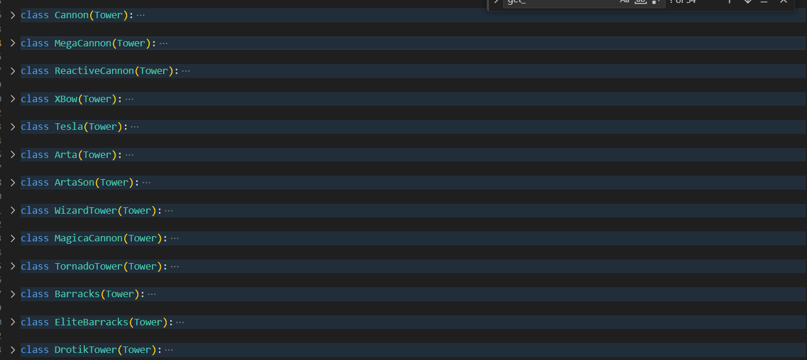
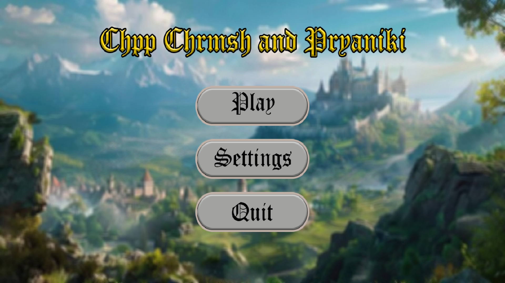
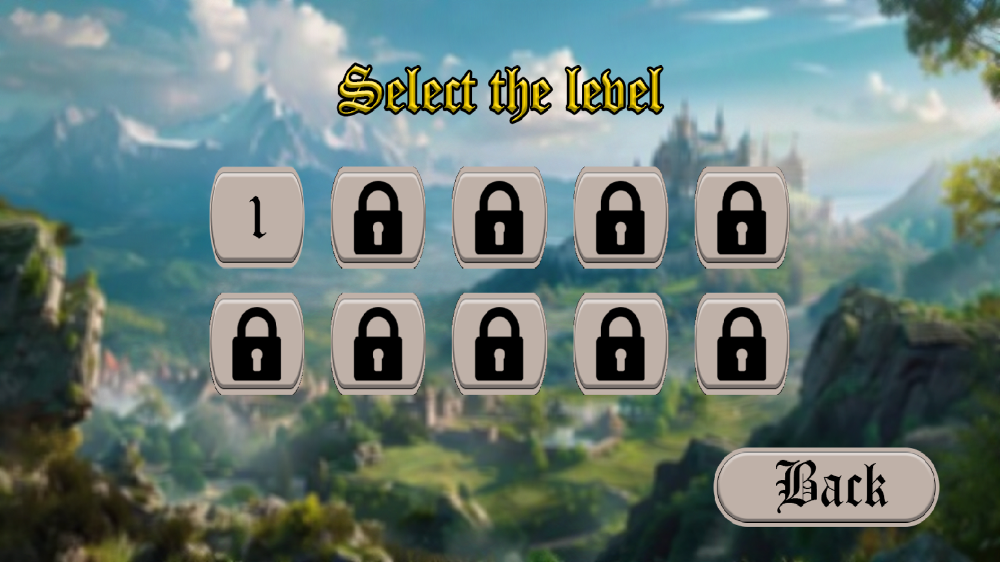
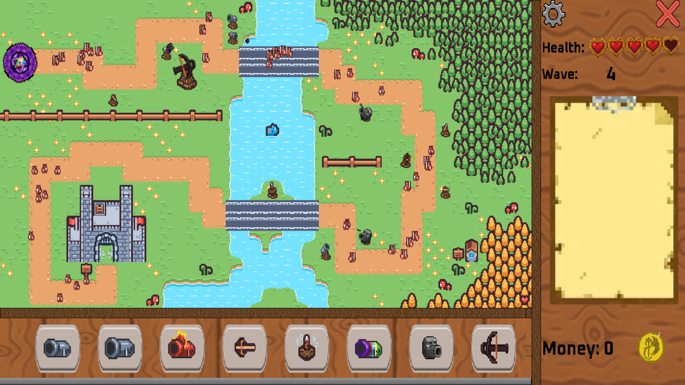

# Tower Defense Game (on PyGame)
## Object Oriented Programming Course Work
## Made by Oleksandr Buhrii, Maksym Khramcov, Mikhailo Diachenko
### Introduction

This project is a Tower Defense Game written on Python with the uses of library PyGame-ce. Also there were used some additional libraries: numpy and pytmx. All sprites and animations were created by hands in Piskel and Photoshop. Map configuration was made in Tiled. There was also implemented file reading to efficiently configure enemy stats and enemies spawn timings.

To run this game you have to launch next scripts:

pip install numpy
pip install pygame-ce
pip install PyTMX

and then you have to run the code/main.py file
### OOP Principles
- Inheritance: <br />
Nearly all classes in the project inherit from some class
```python
class Enemy(pygame.sprite.Sprite):
class swordsman(Enemy):
class tankman(Enemy):
class rogue(Enemy):
```
- Abstraction: <br />
Practically there is no Abstract Classes in the code (as abc), BUT there is a two classes that can be (and actualluy considered) abstract:
1. pygame.sprite.Sprite class
2. pygame.group.Group class

Basically every object that will be displayed on the screen is inherited from Sprite class.
It can be called abstrect because its methods ALWAYS overriden ("update" method)
And a Group class which method "draw" is always overriden.
```python
@singleton
class LevelSprites(pygame.sprite.Group):
    def __init__(self, display_surface):
        ...
    
    # getters and setters
    def get_offset(self):
        ...
    
    def check_ground(self, tower_rect):
        ...

    def draw(self):
        terrain_sprites = [sprite for sprite in self if issubclass(type(sprite), Terrain)]
        portal_sprites = [sprite for sprite in self if hasattr(sprite, 'isportal')]
        range_sprites = [sprite for sprite in self if hasattr(sprite, 'istower_range')]
        hitbox_sprites = [sprite for sprite in self if hasattr(sprite, 'istower_hitbox')]
        tower_sprites = [sprite for sprite in self if hasattr(sprite, 'istower')]
        tower_heads = [sprite for sprite in self if hasattr(sprite, 'istower_head')]
        enemie_sprites = [sprite for sprite in self if hasattr(sprite, 'isenemie')]
        projectile_sprites = [sprite for sprite in self if hasattr(sprite, 'isprojectile')]
        death_sprites = [sprite for sprite in self if hasattr(sprite, 'isdeath')]
        for layer in [terrain_sprites, portal_sprites, range_sprites, hitbox_sprites, tower_sprites,
                       tower_heads, enemie_sprites, projectile_sprites, death_sprites]:
            for sprite in sorted(layer, key = lambda sprite: sprite.get_rect().centery):
                if hasattr(sprite, "hasToBeShown"):
                    if not sprite.hasToBeShown:
                        continue
                self._display_surface.blit(sprite.get_image(), (sprite.get_rect().topleft[0] + self._offset, 
                                                                sprite.get_rect().topleft[1] + self._offset))
```
- Encapsulation: <br />
Here all the methods in all classes firstly was made protected and when needed outside the class getters and setters were written.
```python
class LevelButton:
    def __init__(self, surf, pos, id = None):
        self._image = surf
        self._rect = self._image.get_frect(center = pos)
        self._id = id
    
    def get_image(self):
        return self._image
    
    def get_rect(self):
        return self._rect
    
    def get_id(self):
        return self._id
```
- Polymorphism: <br />
Polymorfism you can see in emplementing different enemy and tower types. Overall functionallity of towers and enemies is written in Enemy and Tower sprites. Sprecific functionality written in sprecific types.
You can see them fully in tower.py and tower_types.py


### OOP Patterns used
- Signleton

```python
def singleton(cls):
    global instances

    def get_instance(*args, **kwargs):
        if cls not in instances:
            instances[cls] = cls(*args, **kwargs)
        return instances[cls]

    return get_instance
```
- Factory Method
```python
class EnemySpawner:
    def __init__(self, spawn_line, turn_lines, enemy_sprites, level_sprites):
        self._enemy_sprites = enemy_sprites
        self._level_sprites = level_sprites

        self._spawn_line = spawn_line
        self._turn_lines = turn_lines

    def create_enemy(self, enemy_type):
        if enemy_type == 'bimba':
            return bimba(self._spawn_line, self._turn_lines, (self._level_sprites, self._enemy_sprites))
        elif enemy_type == 'blue_elemental':
            pass
        elif enemy_type == 'blue_slime':
            return blue_slime(self._spawn_line, self._turn_lines, (self._level_sprites, self._enemy_sprites))
        elif enemy_type == 'fish':
            return fish(self._spawn_line, self._turn_lines, (self._level_sprites, self._enemy_sprites))
        elif enemy_type == 'flying_snake':
            return flying_snake(self._spawn_line, self._turn_lines, (self._level_sprites, self._enemy_sprites))
        elif enemy_type == 'ghost':
            return ghost(self._spawn_line, self._turn_lines, (self._level_sprites, self._enemy_sprites))
        elif enemy_type == 'golem':
            return golem(self._spawn_line, self._turn_lines, (self._level_sprites, self._enemy_sprites))
        elif enemy_type == 'green_elemental':
            pass  
        elif enemy_type == 'LOKI':
            return Loki(self._spawn_line, self._turn_lines, (self._level_sprites, self._enemy_sprites))
        elif enemy_type == 'red_elemental':
            return red_elemental(self._spawn_line, self._turn_lines, (self._level_sprites, self._enemy_sprites))
        elif enemy_type == 'red_slime':
            pass
        elif enemy_type == 'rogue':
            return rogue(self._spawn_line, self._turn_lines, (self._level_sprites, self._enemy_sprites))
        elif enemy_type == 'spearsman':
            return spearsman(self._spawn_line, self._turn_lines, (self._level_sprites, self._enemy_sprites))
        elif enemy_type == 'swordsman':
            return swordsman(self._spawn_line, self._turn_lines, (self._level_sprites, self._enemy_sprites))
        elif enemy_type == 'tankman':
            return tankman(self._spawn_line, self._turn_lines, (self._level_sprites, self._enemy_sprites))
        elif enemy_type == 'wizard':
            pass
        elif enemy_type == 'yellow_elemental':
            pass
        else:
            raise ValueError(f"Unknown enemy type: {enemy_type}")
```

### Functionality
- Game Start Menu


- Levels Select Menu


- Gameplay


### Summary
To sum up, this project was created on PyGame-ce. It was written according to 4 basic OOP principles: encapsulation, inheritance, abstraction, polymorphism. Also I used Singleton and Factory patterns. 
BUT! This project is not just a course work and we are still developing it. Our goal is to deploy this game on Steam. This is nearly an alpha version. Game is functional at the moment, but not good to play. We created main functionality and at the moment and configuring balance in the game at the moment. It is very long process and I did not expected it to be that long. We will improve this game much more and hope it will reach to the state of a game of our dreams. Thank you very much if you read this to the end. You can look for this project state and taste it as a player. We will be grateful if you will share with us your test results.

Contact us here:
aleksusdeveloper@gmail.com
